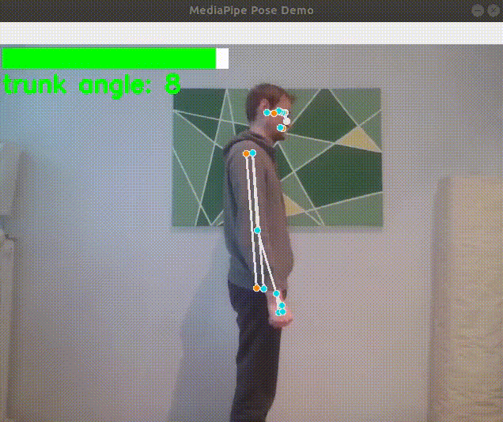

# Ergonomy Demo Using a Webcam With MediaPipe Pose
This code goes with blog post [Detecting Bad Posture With Machine Learning - An Introduction to Real-Time Ergonomic Feedback Using Computer Vision and Machine Learning](https://medium.com/towards-artificial-intelligence/detecting-bad-posture-with-machine-learning-be4b9de763d0)



## Setup
with anaconda: 
```
conda create -n ergonomy python=3.7
conda activate ergonomy
python -m pip install mediapipe

```

## Run 
```
python main.py
```
